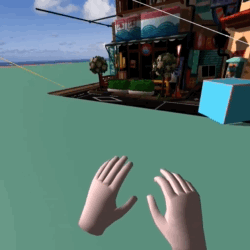
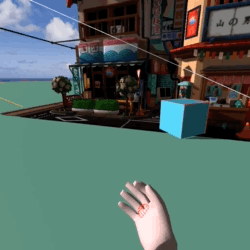
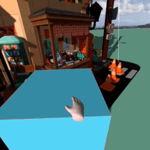
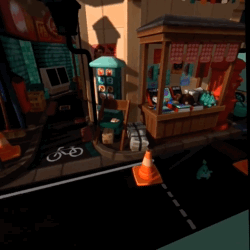
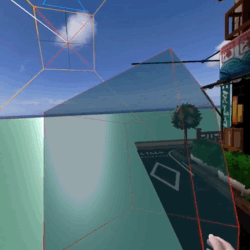

# AFrame boilerplate

This boilerplate aims to solve two problems:

1. CSP restriction on VR devices
2. Collect and configure minimal set of functionalities for successful room-scale VR experiences

## CSP restrictions
The CSP for VR devices is very strict, and whilst things work really nice in browser, running Glitch or loading scripts from CDN sometimes fails when trying to use Vive or Oculus devices.

The easiest way to ensure everything loads and works properly is to serve every script and every asset though ssl, from the same domain.

## This boilerplate will demonstrate

1. Initiate scene making all helpers visible (physics colliders, shadow camera...). Load a gltf object from file, load spherical image to use as sky, place a plane and a cube primitives. 
1. link controllers using super-hands

    
        
1. Teleport using aframe-teleport-controls

    
1. Demonstrate custom componet which truns object transparent when grabbed. Also note that the shadow camera target is linked to the box. Moving the box moves the angle of the light.

    
1. Demostrate shadow camera

    
1. Demostrate physics

    

# Prerequisites

To be able to run "compile" and package code, you have to use [Node.js](https://nodejs.dev/). This boilerplate was build and tested on `Node.js v16.14.0`

# Installation

1. Once you have this code checked out, initiate the build install all the necessary packages. Open the directory where you have downloaded the code in terminal, and run `npm install`
1. Physics module requires a `browserify` packager, but this project uses `webpack` as it is a packager we use in our organisation. To resolve this issue, please edit `./node_modules/aframe-physics-system/src/drivers/worker-driver.js` and modify `require('webworkify')` on the 1st line to `require('webworkify-webpack')`:
        
    <!-- language: lang-js -->
        var webworkify = require('webworkify-webpack'),
            webworkifyDebug = require('./webworkify-debug'),
            Driver = require('./driver'),
            Event = require('./event'),
            worker = require('./worker'),
            protocol = require('../utils/protocol')
    
    if you do not do this, the console will display the followig error:

            index.js:1 Uncaught ReferenceError: arguments is not defined
            at Object.8034 (index.js:1)
            at i (bootstrap:19)
            at Object.7810 (worker-driver.js:3)
            at i (bootstrap:19)
            at Object.2182 (system.js:8)
            at i (bootstrap:19)
            at Object.9435 (index.js:13)
            at i (bootstrap:19)
            at make namespace object:6
            at index.js:65
1. aframe-physics-system official npm distro links to non-existing dependencies, please use the latest build submitted to GitHub ` "aframe-physics-system": "github:n5ro/aframe-physics-system#59100ac83033cf337d26925de1f92854c2988b75",`
1. `package.json` defines three scripts you can run: `watch`, `build`, and `test`. To run them use `npm run` command, for example you would want to use `npm run watch` to initiate npm in the watch mode. Any change to any files in src will automatically trigger build. To prepare and optimise the build run `npm run build`.  

    Code is compiled to the `dist` folder.

# Demo
You can find the complied demo on [our hackathon page](https://zonehackvr.z33.web.core.windows.net/awp/index.html).